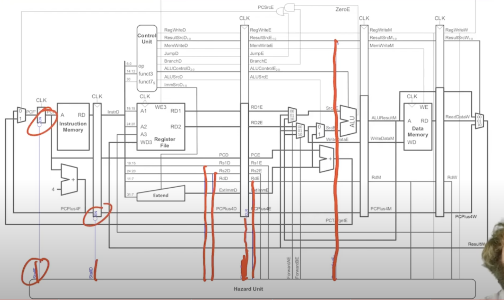

## 5 Stage Pipelined RISC-V MIPS Implementation

### Schematic

### Hazard Types
- Luckily, due to the MIPS 5 stage pipelined design, there can be no *structual hazards*
- Data Hazards
- Control Hazards